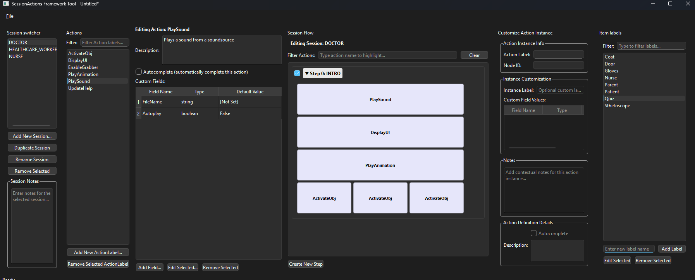

# SessionActionFramework Tool

A powerful, engine-agnostic Python GUI tool for designing and managing complex hierarchical action sequences for interactive simulations, training environments, and narrative experiences.

## Overview

SessionActionFramework is an intuitive visual tool that enables developers and designers to create sophisticated action sequences with complex dependencies, parallel execution paths, and conditional branching. Originally developed for Unity3D training simulations, the framework's JSON-based output makes it compatible with any game engine or simulation platform.

## Key Features

- **Visual Graph Editor**: Design action sequences through an intuitive node-based interface
- **Hierarchical Action System**: Create nested action structures with parent-child relationships
- **Parallel & Sequential Execution**: Define which actions run simultaneously and which must execute in order
- **Custom Field System**: Add configurable parameters to any action instance
- **Multi-Session Management**: Organize complex projects with multiple independent session flows
- **Engine-Agnostic Export**: JSON output format works with Unity, Unreal Engine, Godot, or custom engines
- **Real-time Preview**: Visualize your action flow as you build it

## Use Cases

- **Training Simulations**: Script complex training scenarios with branching paths
- **Interactive Experiences**: Design escape rooms, museum exhibits, or educational content
- **Industrial Simulations**: Model manufacturing processes or safety procedures
- **Game Development**: Create quest systems, cutscenes, or gameplay sequences
- **VR/AR Applications**: Orchestrate immersive narrative experiences

## Installation

### Prerequisites

- Python 3.8 or higher
- pip package manager

### Setup

1. Clone the repository:
   
   ```bash
   git clone <repository-url>
   cd SessionFramework/SessionCreator
   ```

2. Create a virtual environment (recommended):
   
   ```bash
   python -m venv venv
   
   ```

### On Windows:

venv\Scripts\activate


## Quick Start

### Running the Application

```bash
python framework_tool/main.py
```

## User Guide

### 1. Creating a New Project

When you launch the application, a new project is automatically created. You can also:

- Use `File > New Project` to start fresh
- Use `File > Open Project` to load an existing `.json` project file

### 2. Understanding the Interface

The application features a 5-panel layout:



1. **Session Switcher**: Manage multiple session flows within your project
2. **Actions Panel**: Define and configure reusable action templates
3. **Session Flow**: Visual graph editor for building action sequences
4. **Action Instance Customizer**: Configure specific instances of actions
5. **Item Labels**: Manage game objects, NPCs, and other entities

### 3. Defining Actions

Actions are the building blocks of your sequences:

1. In the Actions panel, click "Add Action"
2. Give your action a unique label (e.g., "PlayAnimation", "ShowDialog", "MoveObject")
3. Configure action properties:
   - **Description**: Document the action's purpose
   - **Autocomplete**: Whether the action completes automatically
   - **Custom Fields**: Add configurable parameters (strings, numbers, booleans, etc.)

### 4. Building Session Flows

Create your action sequence in the Session Flow panel:

1. Select a session from the Session Switcher
2. Add action nodes by clicking "Add Action Node"
3. Select which action template to use
4. Connect nodes to define execution order:
   - **Sequential**: Connect nodes in a chain for ordered execution
   - **Parallel**: Create multiple child nodes from a parent for simultaneous execution
5. Configure each instance in the Action Instance Customizer panel

### 5. Working with Custom Fields

Custom fields allow you to parameterize actions:

```json
"customFields": [
  {
    "fieldName": "targetObject",
    "fieldType": "string",
    "defaultValue": "Player"
  },
  {
    "fieldName": "duration",
    "fieldType": "float",
    "defaultValue": 2.5
  }
]
```

### 6. Exporting Your Project

Save your project as JSON:

- Use `File > Save Project` (Ctrl+S)
- Use `File > Save Project As...` to save with a new name

The exported JSON contains:

- Project metadata
- Action definitions
- Session graphs with node relationships
- Custom field values
- Item and object references

## JSON Output Structure

The framework exports a structured JSON format:

```json
{
  "projectMetadata": {
    "projectName": "Training Simulation",
    "formatVersion": "1.0.0",
    "creationDate": "2025-07-03T13:31:34.174774+00:00",
    "author": "Developer Name"
  },
  "actionDefinitions": {
    "ShowInstruction": {
      "description": "Display instruction text to user",
      "autocomplete": false,
      "customFields": [...]
    }
  },
  "sessions": {
    "MainTraining": {
      "nodes": [...],
      "rootNodeIds": [...]
    }
  }
}
```

## 

## Advanced Features

### Conditional Branching

Define conditions for action execution based on game state or user input

### Action Composition

Create complex actions by combining simpler sub-actions

### Runtime Modification

The JSON format allows for runtime modification of sequences without recompilation

### Multi-User Support

Design sequences that respond differently to multiple users or roles

## Requirements

- **Python**: 3.8+
- **PySide6**: 6.5.0+ (Qt for Python)
- **Operating System**: Windows, macOS, or Linux

## 
